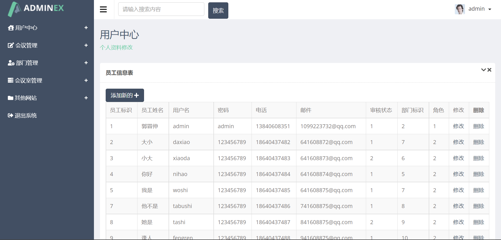
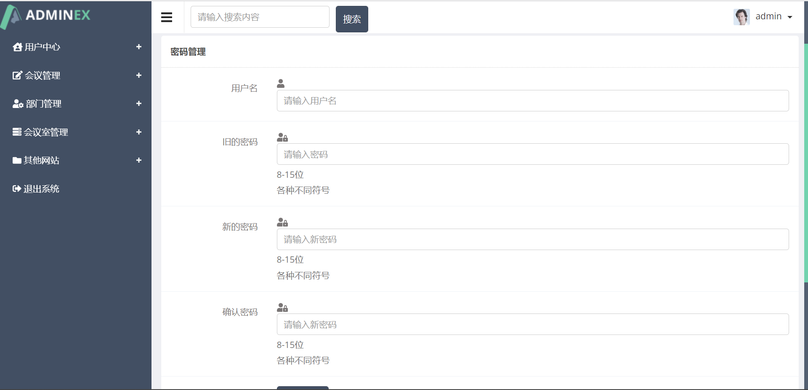
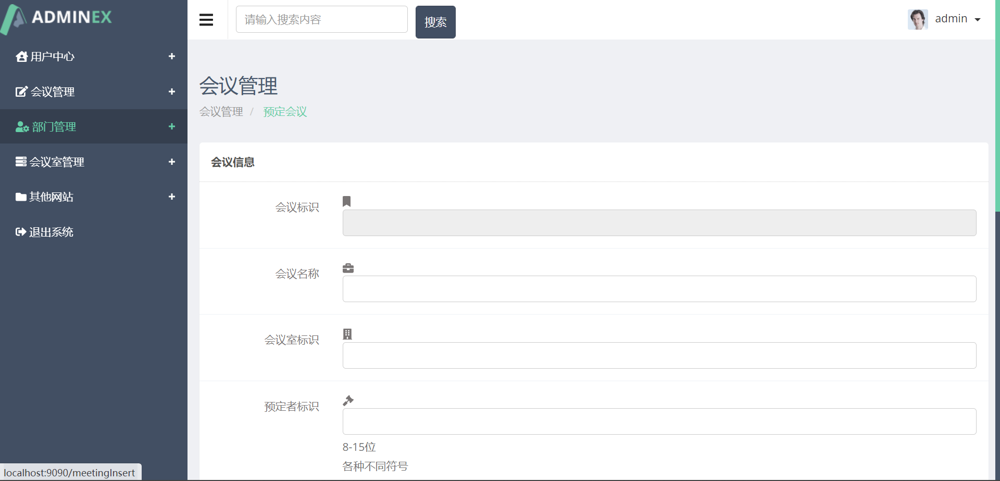
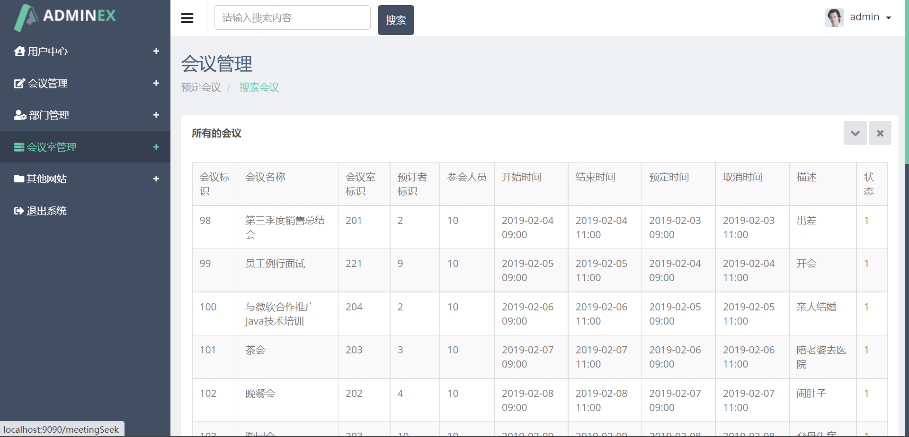
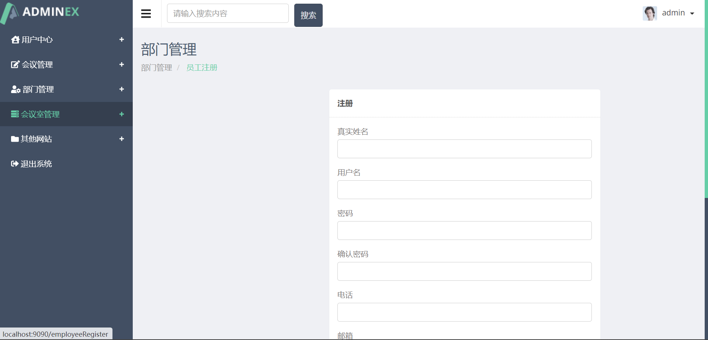
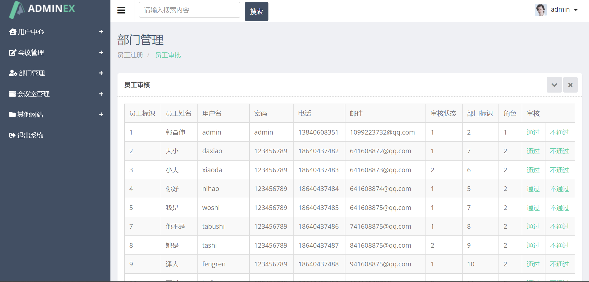
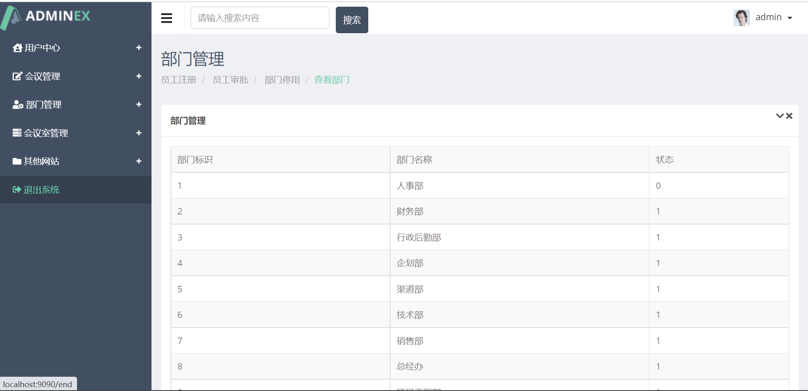
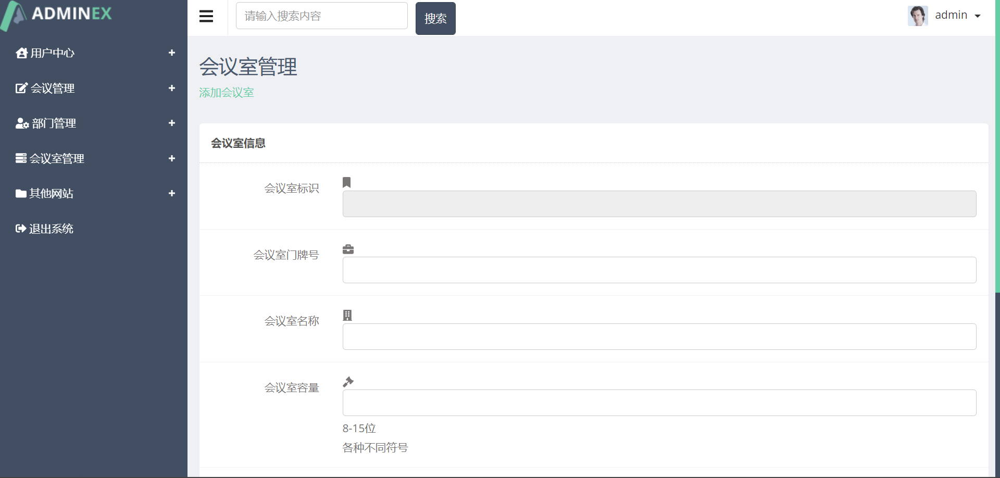
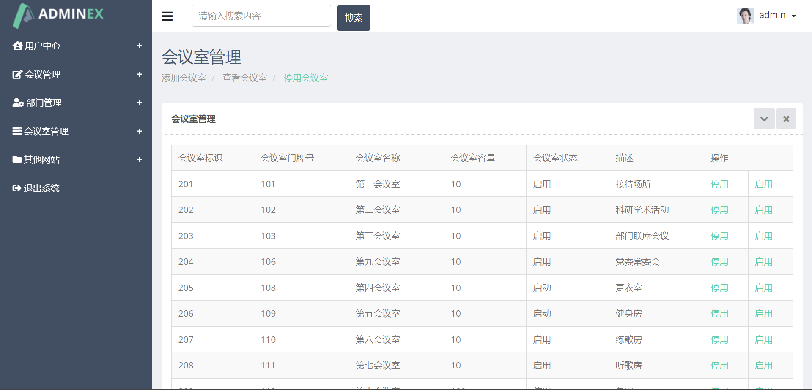
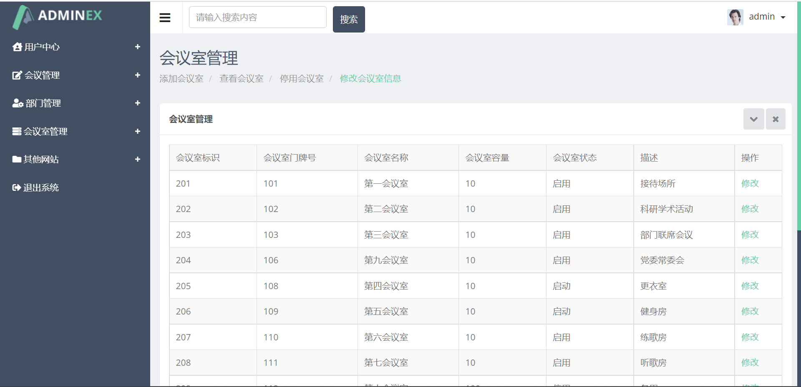

# SpringBoot会议管理系统、
 **

### 定制调试讲解毕业设计加微信jsjbyzd
** 

🎓【毕业设计选题】

在快节奏的工作环境中，会议是企业决策和沟通的重要环节。一个高效、智能的会议管理系统对于提高企业运营效率、确保信息流通具有重要意义。

🛠️【技术栈剖析】

核心框架：SpringBoot，Java企业级应用的轻量级框架，快速搭建RESTful API，保障服务的高效与稳定。
数据库：MySQL，关系型数据库，存储会议信息、用户数据和会议资料。
前端技术：可以选择Thymeleaf模板引擎快速构建页面，或者使用Vue.js等现代JavaScript框架。

📋【系统功能详解】

会议预约：用户可以在线预约会议室，系统自动检查会议室的可用性并进行安排。
会议通知：系统自动发送会议通知给参与者，确保每个人都能及时收到会议信息。
资料共享：会议资料可以上传至系统，方便参与者提前查看和准备。
会议记录：系统支持会议过程中的记录和后续的资料整理，方便追踪和回顾。
数据统计：系统提供会议使用情况的统计分析，帮助企业优化资源配置。

 **

### 学生案例
** 

